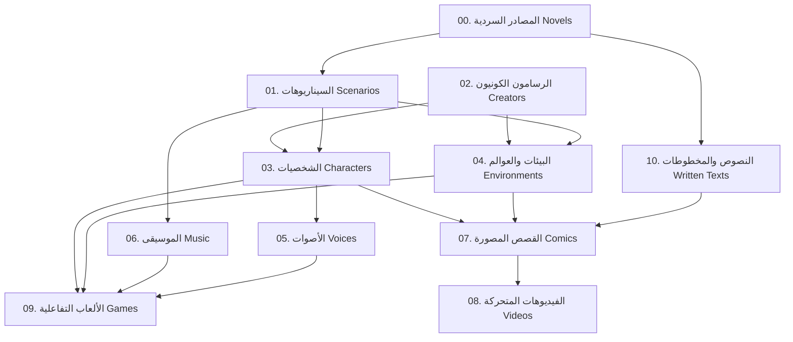

# 🌌 دليل متطلبات ومواصفات إنتاج أصول كون سكتشيك (Sketchic Technical Specifications)

هذا المستند يمثل **خارطة الطريق التقنية** والمواصفات التفصيلية التي يحتاجها كل تطبيق أو محرك ذكاء اصطناعي لإنتاج الأصول المتنوعة في خط الإنتاج الكوني لـ **سكتشيك (Sketchic Universe)**. يوضح المستند المدخلات المطلوبة، والتبعيات الفنية، والمخرجات لكل نوع من أنواع الأصول الـ 11.

---

## 🧭 مخطط تدفق التبعيات البصرية والإنتاجية (Pipeline Diagram)

---

## 1. المصادر السردية (Source Materials - Novels)
*هي المرجعية السردية التأسيسية التي ينطلق منها الكون بالكامل لتأسيس القصة العامة.*

* **المدخلات الفنية المطلوبة:**
  - فكرة أولية عامة (Concept).
  - الفكرة الفلسفية للكون (مثل صراع الأبعاد الحبرية مع الأبعاد الزيتية).
* **مواصفات التطبيق وأدوات الإنتاج:**
  - **الأداة:** نماذج لغوية ضخمة (Gemini 1.5 Pro / Claude 3.5 Sonnet).
  - **درجة الحرارة (Temperature):** 0.7 (لضمان التوازن بين الالتزام بالقوانين والإبداع السردي).
* **المخرجات الفنية وصيغة الملف:**
  - مستند نصي مفصل بصيغة Markdown (`.md`) أو ملف نصي (`.txt`).
  - يجب أن يحتوي على: الحبكة الرئيسية (Plot)، العوالم الزمنية، الفصائل الكونية، وقائمة بالأصول المقترح استخلاصها.

---

## 2. الرسامون الكونيون (Creators - Art Style Guides)
*يحدد القوانين الفيزيائية والفنية للبصمة البصرية في بعد معين.*

* **المدخلات الفنية المطلوبة:**
  - تحديد الأسلوب الفني الحاكم (مثال: لوحة زيتية كلاسيكية، حبر غرافيتي، مانجا يابانية سوداء).
  - الأداة الكونية المستخدمة في الرسم (فرشاة سنجاب، قلم رصاص جاف، إلخ).
* **مواصفات التطبيق وأدوات الإنتاج:**
  - محركات توليد الأنماط الفنية أو لوحات مرجعية (Style References).
* **المخرجات الفنية وصيغة الملف:**
  - دليل الأسلوب الفني في مستند Markdown (`.md`).
  - صور مرجعية للأسلوب البصري (`.png`) بدقة عالية تُستخدم لاحقاً كـ **Style Reference (`--sref`)** في Midjourney.

---

## 3. السيناريوهات التفصيلية (Scenarios)
*تفكيك المصدر السردي الأصلي إلى لقطات ومشاهد قابلة للتصوير والتحريك.*

* **المدخلات الفنية المطلوبة:**
  - مستند المصدر السردي المولد في الخطوة (1).
  - أسلوب الرسام الكوني المرتبط بالبعد في الخطوة (2).
* **مواصفات التطبيق وأدوات الإنتاج:**
  - **الأداة:** نماذج التوليد السردي المهيكلة (Structured LLMs).
* **المخرجات الفنية وصيغة الملف:**
  - ملف سيناريو تفصيلي (`.md`) مبني على صيغة مشاهد هوليوود القياسية (داخلي/خارجي - لقطات الكاميرا - المؤثرات البصرية والسمعية المقترحة - تفاصيل تصادم الأبعاد البصرية في الكادر).

---

## 4. المخطوطات ونصوص العالم (Written Texts - Dialogues)
*صياغة النصوص الحوارية والعبارات الفلسفية المكتوبة داخل الكوادر.*

* **المدخلات الفنية المطلوبة:**
  - المشاهد واللقطات المحددة في السيناريو (الخطوة 3).
  - نبرة الفصيل المتحدث (شاعري غامض، عسكري جاد، إلخ).
* **مواصفات التطبيق وأدوات الإنتاج:**
  - نماذج تحسين صياغة النصوص اللغوية والترجمة الفصحى.
* **المخرجات الفنية وصيغة الملف:**
  - ملف نصوص الحوارات وصيغ الفقاعات المادية المكتوبة (`.md` / `.txt`).

---

## 5. تصميم الشخصيات الكونية (Character Assets)
*التمثيل البصري لأبطال وخصوم الرواية مع الالتزام باتساق المظهر.*

* **المدخلات الفنية المطلوبة:**
  - الوصف السردي للشخصية من السيناريو.
  - أسلوب الرسم المرجعي للرسام (الخطوة 2).
  - الفصيل الحاكم (Awakened / Keepers / Erasers).
* **مواصفات التطبيق وأدوات الإنتاج:**
  - **الأداة:** Midjourney v6 / Imagen 3.
  - **استراتيجية التوليد:** توليد لوحة تصميم شخصية متعددة الزوايا (Character Concept Sheet) مع خلفية بيضاء لسهولة عزلها.
* **المخرجات الفنية وصيغة الملف:**
  - صورة الشخصية بصيغة PNG أو JPG بدقة `300 DPI` (أبعاد 1:1 أو 2:3).
  - رابط صورة المرجع الأساسية لتمريرها لاحقاً لإنتاج القصص المصورة كمرجع اتساق الشخصية (`--cref`).

---

## 6. العوالم والبيئات البصرية (Environments & Backgrounds)
*الخلفيات والأماكن الكونية التي تقع فيها الصراعات الفنية.*

* **المدخلات الفنية المطلوبة:**
  - وصف موقع المشهد من السيناريو.
  - كثافة تداخل الأبعاد والجاذبية في تلك المنطقة (Boundary Clash Density).
* **مواصفات التطبيق وأدوات الإنتاج:**
  - **الأداة:** Midjourney / Stable Diffusion 3.
* **المخرجات الفنية وصيغة الملف:**
  - لوحات بيئية عريضة بدقة عالية وصيغة PNG (أبعاد سينمائية مثل 16:9).

---

## 7. الأصوات الكونية (Cosmic Voices)
*تحويل الحوارات المكتوبة إلى بصمات صوتية معبرة وتناسق النغمات.*

* **المدخلات الفنية المطلوبة:**
  - النص الحواري للشخصية من المخطوطة (الخطوة 4).
  - دليل النبرة الصوتية والجنس والعمر والسرعة المقترحة.
* **مواصفات التطبيق وأدوات الإنتاج:**
  - **الأداة:** ElevenLabs API / Google TTS (محركات الذكاء الاصطناعي الصوتي المتطورة).
  - **ميزة حيوية:** استنساخ الصوت وتنسيق مخارج الحروف العربية والإنجليزية الفصحى.
* **المخرجات الفنية وصيغة الملف:**
  - ملف صوتي نقي وصيغة MP3 أو WAV بمعدل ترميز لا يقل عن `192kbps`.

---

## 8. الموسيقى الكونية (Cosmic Music & Soundtracks)
*الألحان التصويرية التي تدعم الصراع البصري وتحدد المزاج الدرامي للمشاهد.*

* **المدخلات الفنية المطلوبة:**
  - فكرة الموسيقى (كلاسيكية زيتية هادئة مقابل إلكترونية صاخبة ممزقة).
  - نمط الآلات الموسيقية (Violin, Synthesizer, Drums).
  - سرعة الإيقاع (BPM).
* **مواصفات التطبيق وأدوات الإنتاج:**
  - **الأداة:** Suno AI API / Udio AI.
* **المخرجات الفنية وصيغة الملف:**
  - مسارات موسيقى تصويرية كاملة بصيغة MP3 أو WAV جودة ستوديو عالي النقاوة.

---

## 9. القصص المصورة (Comics & Storyboards)
*أصل وسيط فائق الأهمية، يدمج الشخصيات والبيئات والحوارات في إطارات رسومية ثابتة ومتسقة.*

* **المدخلات الفنية المطلوبة:**
  - **السيناريو التفصيلي** (الخطوة 3) + **مخطوط الحوارات** (الخطوة 4).
  - **الصور المرجعية للشخصيات (`--cref`)** لضمان تطابق ملامح البطل عبر كافة الإطارات.
  - **الصور المرجعية للبيئات والخلفيات**.
* **مواصفات التطبيق وأدوات الإنتاج:**
  - **الأدوات:** Photoshop / Figma / Midjourney (توليد متعدد الكوادر باستخدام البنية الهيكلية للإطارات).
  - **عملية الدمج:** عزل الشخصيات ووضعها فوق البيئات، ورسم فقاعات الكلام يدوياً أو برمجياً بناءً على مخطط الحوار.
* **المخرجات الفنية وصيغة الملف:**
  - ملف لوحات قصة مصورة طولي (ويب تون للموبايل) أو ملف PDF مجمع عالي الدقة، وصور فردية لكل كادر بصيغة PNG.

---

## 10. مقاطع الفيديو المتحركة واللقطات السينمائية (Videos & Cinematics)
*تحريك الإطارات الثابتة وبث الحياة في صراع الأبعاد.*

* **المدخلات الفنية المطلوبة:**
  - **الصورة المرجعية للقطة (Image Input)**: مأخوذة مباشرة من كادر القصة المصورة (الخطوة 9) أو بيئة المشهد (الخطوة 6).
  - **المسار الصوتي للمشهد** (الأصوات الكونية في الخطوة 7 + الموسيقى التصويرية في الخطوة 8).
  - **موجه الحركة والتأثيرات البصرية**: حركة الكاميرا (Pan, Zoom, Tilt) ونوع التحريك الفني (تفكك الخطوط، ذوبان الألوان الزيتية).
* **مواصفات التطبيق وأدوات الإنتاج:**
  - **الأداة:** Runway Gen-3 Alpha / Sora / Kling AI / Luma Dream Machine.
  - **وضع الإنتاج:** صورة إلى فيديو (Image-to-Video) لضمان اتساق الشخصيات والبيئة بنسبة 100%. التوليد النصي للفيديو مباشرة (Text-to-Video) يتسبب في فقدان اتساق الشخصيات والنمط الفني وهو أمر غير مقبول في هذا المشروع.
* **المخرجات الفنية وصيغة الملف:**
  - مقاطع فيديو بصيغة MP4 بدقة HD 1080p أو 4K، وبمعدل إطارات لا يقل عن 24 إطاراً في الثانية.

---

## 11. الألعاب التفاعلية (Downloadable Games)
*الناتج التفاعلي النهائي الذي يسمح للمشاهد بخوض تجربة الصراع بنفسه.*

* **المدخلات الفنية المطلوبة:**
  - أصول الشخصيات معزولة كعناصر متحركة ثنائية أو ثلاثية أبعاد (Sprites/Spritesheets).
  - أصول البيئات مقطعة إلى طبقات أمامية وخلفية لبناء عمق بصري (Parallax Scrolling).
  - الموسيقى الخلفية والمؤثرات الصوتية (WAV).
  - ملف السيناريو والميكانيكية المحددة للعبة (مثل بوابات التحول الفني).
* **مواصفات التطبيق وأدوات الإنتاج:**
  - **الأداة:** محرك الألعاب Unity / Godot / PhaserJS (للويب).
  - **الميكانيكية الرئيسية:** برمجة الشيدر (Shaders) لتغيير أسلوب رسم الشخصية أو العالم في الوقت الفعلي عند ملامسة شقوق الأبعاد الكونية.
* **المخرجات الفنية وصيغة الملف:**
  - مجلد مضغوط ZIP يحتوي على بناء اللعبة المصدرية للويب (`WebGL Build`) أو ملف تنفيذي مستقل للكمبيوتر (`.exe`).
