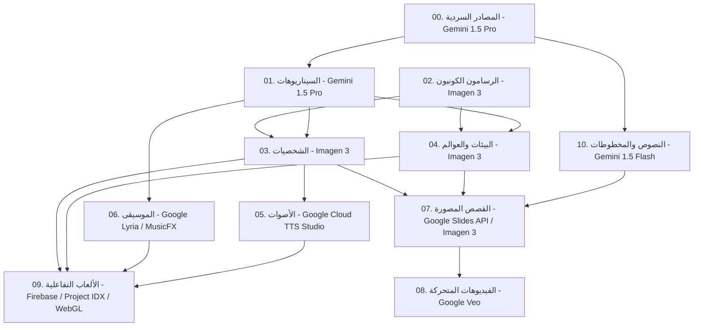

# 🌌 دليل متطلبات ومواصفات إنتاج أصول كون سكتشيك (بيئة جوجل السحابية والذكاء الاصطناعي - Google AI Ecosystem)

هذا المستند يمثل **خارطة الطريق التقنية** المحدثة بالكامل لتعمل بنسبة 100% باستخدام **منتجات وخدمات جوجل (Google Products & APIs)**. يضمن هذا التوجه تكاملاً فائقاً، أماناً عالياً، وسرعة في الربط والتطوير عبر منصة سحابية موحدة.

---

## 🧭 مخطط تدفق الإنتاج باستخدام تقنيات جوجل (Google AI Pipeline)

---

## 1. المصادر السردية (Source Materials - Novels)
*تأسيس القصة العامة والأبعاد المتداخلة لكون سكتشيك.*

* **الخدمة المستخدمة من جوجل:** **Google Gemini 1.5 Pro API** (من خلال Google AI Studio أو Vertex AI).
* **المميزات الفنية للخدمة:**
  - نافذة سياق ضخمة (تصل إلى 2 مليون Token) تتيح تحميل روايات وكتب مرجعية كاملة لضمان التناسق.
  - دعم عالي جداً للغة العربية الفصحى وأسلوب البلاغة الأدبية.
* **المخرجات الفنية وصيغة الملف:**
  - مستند Markdown (`.md`) يتم رفعه تلقائياً إلى مجلد **`00_Source_Materials`** في **Google Drive** باستخدام **Google Drive API**.

---

## 2. الرسامون الكونيون والأدلة البصرية (Creators - Art Style Guides)
*إنشاء النمط والسمة الجمالية لكل بعد كوني.*

* **الخدمة المستخدمة من جوجل:** **Google Imagen 3 API** (من خلال Vertex AI).
* **المميزات الفنية للخدمة:**
  - قدرة فائقة على فهم التفاصيل المعقدة للأنماط الفنية (زيتي، مائي، حبر غرافيت، كارتون) بدقة متناهية مقارنة بالنماذج الأخرى.
  - إمكانية استخراج وضبط متغيرات النمط البصري كـ **Style Reference** رقمي.
* **المخرجات الفنية وصيغة الملف:**
  - ملف وثيقة نمط بصري (`.md`) وصور مرجعية بدقة عالية (`.png`) تحفظ في مجلد **`02_Creators_Paintings`** في **Google Drive**.

---

## 3. السيناريوهات التفصيلية (Scenarios)
*تفكيك القصة السردية إلى مشاهد سينمائية مجزأة.*

* **الخدمة المستخدمة من جوجل:** **Google Gemini 1.5 Pro API** (مع تفعيل خيار **Structured Outputs / JSON Schema**).
* **المميزات الفنية للخدمة:**
  - إرغام النموذج على إخراج السيناريو بهيكل بيانات محدد (مشاهد، لقطات كاميرا، توجيهات إضاءة، وفيزياء حركة) مما يسهل معالجتها برمجياً من قبل التطبيقات الأخرى.
* **المخرجات الفنية وصيغة الملف:**
  - مستند سيناريو مهيكل (`.json` أو `.md`) يحفظ في مجلد **`01_Scenarios`** في **Google Drive**.

---

## 4. المخطوطات ونصوص العالم (Written Texts - Dialogues)
*صياغة النصوص الحوارية وتأثيرات الكتابة البصرية.*

* **الخدمة المستخدمة من جوجل:** **Google Gemini 1.5 Flash API** (مناسب للمهام اللغوية السريعة ومنخفضة التكلفة).
* **المميزات الفنية للخدمة:**
  - سرعة استجابة فائقة وزمن زمن انتقال (Latency) منخفض جداً لتوليد الحوارات والتراجم المباشرة في واجهة المستخدم.
* **المخرجات الفنية وصيغة الملف:**
  - ملف نصوص وصيغ حوارات (`.txt` / `.md`) يحفظ في مجلد **`10_Written_Texts`** في **Google Drive**.

---

## 5. تصميم الشخصيات الكونية (Character Assets)
*التمثيل البصري لأبطال وخصوم الرواية.*

* **الخدمة المستخدمة من جوجل:** **Google Imagen 3 (Image-to-Image / Inpainting)**.
* **المميزات الفنية للخدمة:**
  - تتيح ميزة Inpainting تعديل ملابس أو أسلحة الشخصية يدوياً وبرمجياً مع الحفاظ على ملامح الوجه والجسد ثابتة.
  - دقة عالية جداً في رسم الملامح وتجنب التشوهات البصرية الشائعة.
* **المخرجات الفنية وصيغة الملف:**
  - صور شخصيات معزولة الخلفية بصيغة PNG تحفظ في مجلد **`03_Characters_Assets`** في **Google Drive**.

---

## 6. العوالم والبيئات البصرية (Environments & Backgrounds)
*الخلفيات والأماكن الكونية التي تقع فيها الصراعات الفنية.*

* **الخدمة المستخدمة من جوجل:** **Google Imagen 3 API** (الوضع السينمائي العريض 16:9).
* **المميزات الفنية للخدمة:**
  - إدراك ممتاز للنصوص الجغرافية وتداخل الضوء والظلال وتجسيد الاصطدام البصري الفني عند حواف البيئات.
* **المخرجات الفنية وصيغة الملف:**
  - لوحات خلفيات عريضة بصيغة PNG دقة 4K تحفظ في مجلد **`04_Environments_Assets`** في **Google Drive**.

---

## 7. الأصوات الكونية (Cosmic Voices)
*تحويل الحوارات المكتوبة إلى بصمات صوتية معبرة.*

* **الخدمة المستخدمة من جوجل:** **Google Cloud Text-to-Speech API (Studio Voices)**.
* **المميزات الفنية للخدمة:**
  - توفر أصوات **Studio & Neural2** فائقة الجودة تدعم اللغة العربية الفصحى بشكل مذهل ونبرة طبيعية تحاكي الممثلين البشريين.
  - التحكم المطلق في طبقة الصوت ونبرته وسرعة نطق الحروف باستخدام وسوم **SSML**.
* **المخرجات الفنية وصيغة الملف:**
  - ملف صوتي عالي النقاوة بصيغة MP3 أو WAV يحفظ في مجلد **`05_Voices_Audios`** في **Google Drive**.

---

## 8. الموسيقى الكونية (Cosmic Music & Soundtracks)
*الألحان التصويرية التي تدعم الصراع البصري وتحدد المزاج الدرامي للمشاهد.*

* **الخدمة المستخدمة من جوجل:** **Google MusicFX (من خلال Vertex AI / Lyria Model)**.
* **المميزات الفنية للخدمة:**
  - نموذج **Lyria** من Google DeepMind يتيح توليد موسيقى خلفية غنية عالية الجودة بناءً على وصف نصي للآلات الموسيقية والمزاج وسرعة الإيقاع دون مشاكل حقوق ملكية.
* **المخرجات الفنية وصيغة الملف:**
  - مسارات ساوندتراك بصيغة MP3 جودة ستوديو تحفظ في مجلد **`06_Cosmic_Soundtracks`** في **Google Drive**.

---

## 9. القصص المصورة (Comics & Storyboards)
*دمج الشخصيات والبيئات والحوارات في إطارات رسومية متسقة.*

* **الخدمة المستخدمة من جوجل:** دمج **Google Imagen 3 (Image-to-Image)** مع **Google Workspace APIs (Google Slides / Docs API)**.
* **المميزات الفنية للخدمة:**
  - يمكن للتطبيقات استخدام **Google Slides API** لترتيب إطارات الكوميكس، وتوزيع الشخصيات والبيئات كطبقات داخل الشرائح، وإضافة حقول النصوص لفقاعات الكلام برمجياً وتصديرها كملف PDF موحد.
* **المخرجات الفنية وصيغة الملف:**
  - ملف PDF مجمع أو ملف عرض تقديمي تفاعلي يحفظ في مجلد **`07_Comics_Storyboards`** في **Google Drive**.

---

## 10. مقاطع الفيديو المتحركة واللقطات السينمائية (Videos & Cinematics)
*تحريك الإطارات الثابتة وبث الحياة في صراع الأبعاد.*

* **الخدمة المستخدمة من جوجل:** **Google Veo** (نموذج توليد الفيديو السينمائي الرائد من Google DeepMind).
* **المميزات الفنية للخدمة:**
  - دقة توليد فيديو تفوق 1080p بمعدل حركة انسيابي ممتاز.
  - فهم فائق لحركات الكاميرا السينمائية المعقدة (أوامر مثل: cinematic lighting, drone shot, panning).
  - دعم قوي جداً لخاصية **Image-to-Video** لتحريك كوادر القصص المصورة دون تغيير هوية الشخصيات أو البيئة.
* **المخرجات الفنية وصيغة الملف:**
  - مقاطع فيديو متحركة بصيغة MP4 تحفظ في مجلد **`08_Videos_Cinematics`** في **Google Drive**.

---

## 11. الألعاب التفاعلية (Downloadable Games)
*الناتج التفاعلي النهائي الذي يدمج كافة الأصول في تجربة لعب حية.*

* **الخدمة والمنصة المستخدمة من جوجل:** **Google Firebase (Hosting & Cloud Functions)** + بيئة التطوير السحابية **Google Project IDX**.
* **المميزات الفنية للخدمة:**
  - استخدام **Project IDX** لبناء وتطوير اللعبة بلغة JavaScript/WebGL بسرعة فائقة في المتصفح.
  - استضافة اللعبة ونشرها للمستخدمين بضغطة زر عبر **Firebase Hosting**.
  - ربط الذكاء الاصطناعي التوليدي (Gemini API) داخل اللعبة عبر Cloud Functions لتوليد حوارات تفاعلية للأعداء والشخصيات غير اللاعبة (NPCs) بشكل ديناميكي.
* **المخرجات الفنية وصيغة الملف:**
  - حزمة اللعبة (WebGL Build) مضغوطة بصيغة ZIP تحفظ في مجلد **`09_Downloadable_Games`** في **Google Drive**.
