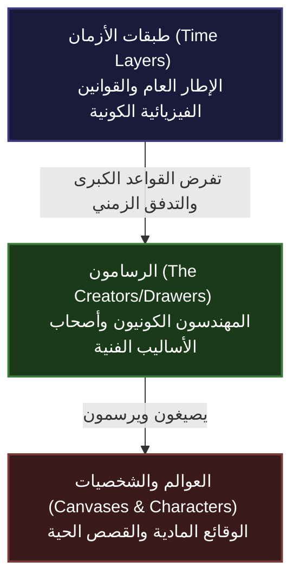

# ميثاق كون "سكتشيك" السينمائي (Sketchic Universe Bible)
## الوثيقة التأسيسية لبناء العالم الممتد

---

## 1. فلسفة الخلق: الرسم كأداة للخلق المطلق (Drawing as the Source of Reality)

في كون **"سكتشيك" (Sketchic)**، لا يُعدّ الرسم مجرد وسيلة تعبيرية أو محاكاة بصرية للواقع؛ بل هو **الفيزياء الأساسية والجوهر الوجودي لكل ما هو كائن**. الخطوط هي أوتار الوجود، والألوان هي طاقته وحيويته، والمساحات الفارغة (الفراغ الأبيض) هي العدم المستعد للاستقبال.

> *«في البدء لم تكن هناك كلمة، بل كانت هناك ضربة فرشاة أولى.»*
> — من ألواح الزمن الأول لكون سكتشيك

```
                                 ┌────────────────────────┐
                                 │    الفراغ اللانهائي     │
                                 │   (The Blank Canvas)   │
                                 └───────────┬────────────┘
                                             │
                                     ضربة الفرشاة الأولى
                                             │
                                             ▼
                                 ┌────────────────────────┐
                                 │    الخطوط والأشكال      │
                                 │   (Line and Contour)   │
                                 └───────────┬────────────┘
                                             │
                                   الملء والتلوين والتظليل
                                             │
                                             ▼
                                 ┌────────────────────────┐
                                 │  المادة السائلة للواقع   │
                                 │    (Liquid Reality)    │
                                 └────────────────────────┘
```

### القوانين الميتافيزيقية للرسم كخلق:
1. **قانون الخط الوجودي (Law of the Line):** كل كائن أو جماد أو كوكب يبدأ كخط خارجي (Outline). هذا الخط يحدد كتلته وجاذبيته وحدوده المادية. إذا تآكل الخط أو تكسر، ضعفت البنية الفيزيائية للشيء في العالم.
2. **قانون الحبر والمادة (The Medium is the Matter):** تختلف فيزياء الأشياء بالاف المادة التي رُسمت بها:
   - **الرصاص والغرافيت:** مواد مرنة، قابلة للتعديل والتحول السريع، لكنها سريعة العطب ومستهدفة دائماً بالمحو.
   - **الحبر الأسود (Ink):** مادة صلبة، حاسمة، غير قابلة للتراجع، تمثل القوانين غير القابلة للكسر والحقائق الوجودية المطلقة.
   - **الألوان الزيتية والكلاسيكية:** تمنح المادة كثافة وجاذبية عالية، وتجعل الزمن يتدفق فيها ببطء ووقار.
   - **الرقمي (Digital Pixels):** يمنح القدرة على الانتقال الآني، والنسخ والتكرار، لكنه يعاني من هشاشة الاستقرار عند انقطاع الطاقة الكونية.
3. **قانون المحو (The Absolute Void):** المحو ليس غياباً للمادة فحسب، بل هو "مضاد المادة" (Antimatter). الممحاة (The Eraser) هي السلاح الكوني الأكثر رعباً، حيث لا تقتل الشخصية بل تنزع أصل وجودها من اللوحة التاريخية.

---

## 2. الهيكل الهرمي الثلاثي للكون الكوني (The Tripartite Cosmic Hierarchy)

يتكون كون "سكتشيك" من هيكل هرمي ثلاثي الطبقات، حيث تؤثر كل طبقة في التي تليها، وتخضع القوانين الفيزيائية تدريجياً لسيطرة الفن.



### الطبقة الأولى: طبقات الأزمان (Time Layers)
هي السقف العلوي للمتعدد الكوني، وتُمثّل **"كرتون الورق" الكوني** أو الشرائح الممتدة التي تُحفظ عليها العوالم.
- **فيزياء الإطارات (Framerate Physics):** لا يتدفق الوقت في سكتشيك بشكل مستمر، بل يتدفق عبر "إطارات في الثانية" (Frames per Second). بعض الأزمان تدور بسرعة 60 إطاراً في الثانية (أزمان ذات وتيرة بالغة التعقيد والنعومة البصرية)، بينما تدور أزمان أخرى بـ 12 إطاراً فقط (أزمان بطيئة، ذات طابع ميكانيكي أو كلاسيكي).
- **الطبقات الزمنية المتوازية:** تنقسم الأزمان إلى طبقات شفافة فوق بعضها البعض (مثل طبقات برامج الرسم - Layers). يمكن لحدث في الطبقة العليا (Layer 1) أن يلقي بظلاله على الطبقة السفلى (Layer 2) دون أن يتداخل معها مادياً، ما لم يحدث خرق في الحدود الفاصلة.

### الطبقة الثانية: الرسامون (The Creators / The Drawers)
هم الآلهة والمهندسون الكونيون الذين يقفون خلف اللوحات. كل رسام يمتلك أسلوباً فنياً فريداً يمثل "توقيعه الجيني".
- **الأسلوب كقانون طبيعي:** أسلوب الرسام الفني هو بمثابة الجاذبية والثرموديناميكا لعالمه. الرسام الذي يرسم بأسلوب الانطباعية (Impressionism) يخلق عالماً تتلاشى فيه التفاصيل الدقيقة وتعتمد الفيزياء فيه على الضوء واللون الجريء. بينما الرسام الذي يتبنى الواقعية المفرطة (Hyperrealism) يفرض قوانين فيزيائية معقدة ودقيقة للغاية.
- **صراع المبدعين:** الرسامون ليسوا دائماً على وفاق. صراعاتهم الفلسفية والفنية حول "كيف يجب أن يبدو الوجود" تنعكس مباشرة كحروب كونية وزلازل جمالية في العوالم السفلى.

### الطبقة الثالثة: العوالم والشخصيات (The Canvases & Characters)
هي اللوحات الحية والواقع المادي الفعلي الذي تعيش فيه الشخصيات وتتفاعل ضمن إطاراتها السردية.
- **الشخصيات المستيقظة (The Awakened Characters):** هي شخصيات استطاعت عبر صدمة سردية أو وعي ذاتي متقدم إدراك حقيقة كونها "مرسومة". تكتسب هذه الشخصيات القدرة على التلاعب بالخطوط المحيطة بها، أو سرقة حبر من بيئتها لإعادة رسم واقعها، أو حتى محاولة التواصل مع "الرسام" مباشرة.
- **اللوحات الحية (Living Canvases):** البيئات التي تتحرك وتتنفس. الجبال في عالم الحبر الصيني التقليدي تتصرف كغيوم سائلة، بينما المباني في عالم المستقبل الرقمي تتكون من خطوط متجهة (Vectors) يمكن إعادة تحجيمها دون فقدان جودتها.

---

## 3. ظاهرة الصدام المرئي (Visual Clash): فلسفة التنافر الجمالي

تُعتبر **ظاهرة الصدام المرئي (Visual Clash)** هي الميزة السردية والجمالية الجوهرية لكون "سكتشيك". تحدث هذه الظاهرة عندما تتقاطع شخصيات أو عناصر من عوالم ذات أساليب فنية متناقضة تماماً في مساحة جغرافية أو سردية واحدة.

```
       ┌───────────────────────────┐         ┌───────────────────────────┐
       │   شخصية بأسلوب المانجا    │         │  شخصية بأسلوب الزيت الكلاسيكي│
       │       (Manga Style)       │         │    (Classical Oil Painting)│
       │  • خطوط حبر سوداء حادة     │         │  • ألوان غنية وضبابية      │
       │  • تظليل نقطي (Screentone) │         │  • إضاءة تشياروسكورو عميقة │
       │  • حركة ديناميكية قوية     │         │  • ملمس قماش حسي           │
       └─────────────┬─────────────┘         └─────────────┬─────────────┘
                     │                                     │
                     └──────────────────┬──────────────────┘
                                        │
                                        ▼
                       ┌─────────────────────────────────┐
                       │   حدود الصدام المرئي المشترك    │
                       │     (Visual Clash Boundary)     │
                       │                                 │
                       │ * لا يندمجان جمالياً            │
                       │ * تحتفظ كل شخصية بفيزيائها الفنية│
                       │ * احتكاك بصري عند خط التماس     │
                       └─────────────────────────────────┘
```

### جوهر الظاهرة: التفاعل دون اندماج (Juxtaposition without Fusion)
عندما تلتقي شخصية مرسومة بـ **أسلوب الكوميكس الأمريكي القديم (Pop-Art)** بشخصية من **عصر النهضة الإيطالية (Renaissance Oil)** في نفس الكادر السينمائي:
- **الحفاظ على الهوية البصرية:** لا تتحول الشخصية الكلاسيكية الزيتية إلى أسلوب الكوميكس، ولا تكتسب شخصية الكوميكس ظلالاً زيتية ناعمة. بدلاً من ذلك، تظهر الشخصيتان جنباً إلى جنب محتفظتين بخواصهما الفنية الأصلية بنسبة 100%.
- **التناقض الحركي والإطاري:** تتحرك شخصية الكوميكس مثلاً بقفزات حركية خشنة (Keyframes متباعدة) بينما تتحرك الشخصية الزيتية بنعومة تامة، مما يصنع تبايناً مدهشاً في الحركة داخل نفس المشهد الموحد.

### الفلسفة العميقة للصدام المرئي:
الصدام المرئي هو تمثيل بصري مادي لـ **"صراع الحضارات والهويات والأفكار"**. عندما يرفض النمطان الفنيان الذوبان في بعضهما البعض، فإنهما يعلنان أن الوجود لا يمكن صهره في قالب واحد. الجمال يكمن في الاختلاف الصارخ، والتفاعل بين المتناقضات هو ما يولد الطاقة الدرامية.

### القوانين الفيزيائية لمنطقة التماس (Interface Physics):
1. **القص اللوني والتنافر الضوئي (Chromatic Shear):** الضوء الساقط على الشخصيتين يتصرف بشكل مختلف. الضوء الواقع على شخصية الواقعية المفرطة ينتج ظلالاً ناعمة متدرجة، بينما نفس مصدر الضوء عندما يسقط على شخصية الـ Cel-Shaded (الرسوم ثنائية الأبعاد) ينعكس ككتلة لونية صلبة واحدة (Flat Color). هذا يخلق حافة وهمية متوهجة بينهما تُعرف بـ **"غشاء التماس البصري"**.
2. **عدم توافق الجاذبية الجمالية:** الجاذبية قد تعمل بشكل مختلف لكل طرف. الشخصية المرسومة بخطوط الفحم الخفيفة قد تزن غرامات قليلة وتتأثر بالرياح بسهولة، بينما الشخصية المنحوتة بالرسم المائي المشبع بالسوائل تكون ثقيلة وبطيئة الحركة.
3. **لغة الجسد والصوت المتنافرة:** عندما تتحدث شخصية صامتة من القصص المصورة، قد تظهر كلماتها كـ **"فقاعات كلامية" (Speech Bubbles)** مادية تطفو في الهواء، ويمكن للشخصية الكلاسيكية الزيتية أن تلمس هذه الفقاعات أو حتى تكسرها كأجسام صلبة!

---

## 4. أدوار القوى الفاعلة في الكون المتعدد (Faction Dynamics)

| الكيان / الفئة | المظهر الفني السائد | الهدف الأساسي والوظيفة السردية | السلاح / القدرة المميزة |
| :--- | :--- | :--- | :--- |
| **حراس الأزمان (Time Keepers)** | أسلوب المخططات الهندسية الزرقاء (Blueprints) والخطوط الفنية الدقيقة | حماية هيكل الطبقات ومنع التداخل العشوائي أو الصدامات المرئية غير المنظمة التي قد تؤدي إلى انهيار اللوحات الكونية. | **قلم القياس الكوني (The Stylus of Order):** القدرة على إعادة رسم الحدود الفاصلة وإغلاق بوابات التماس. |
| **قوى المحو (The Erasers)** | الفراغ المطلق، غياب الملامح، بقع بيضاء وسوداء سائلة تشبه الحبر المنسكب والمذيبات كالتينر. | تجريد العوالم من ألوانها وتفاصيلها الفنية وتحويلها إلى "لوحة بيضاء فارغة" (Blank Canvas) لإعادة البدء من الصفر. | **ممحاة الفوضى (The Oblivion Eraser):** محو الخطوط الخارجية وتفتيت البنية الفيزيائية للشخصيات والبيئات. |
| **الشخصيات المستيقظة (The Awakened)** | هجين ومتغير (تتداخل الأساليب الفنية على أجسادهم نتيجة التنقل بين العوالم). | اكتشاف حقيقة كونهم "مجرد رسمة"، والتحرر من إملاءات الرسامين، والبحث عن "المرسم الكوني الأول" لتقرير مصيرهم بأنفسهم. | **الرسم الذاتي (Self-Redrawing):** القدرة على إعادة رسم أطرافهم أو أدواتهم لتغيير فيزيائهم وتجاوز إطار المشهد. |

---

## 5. دليل التصميم البصري والإخراجي للأكوان السينمائية (Director's Visual Guide)

لكي ينجح تجسيد كون "سكتشيك" في أي وسيط بصرى (سينما، ألعاب فيديو، رسوم متحركة)، يجب على المخرجين وصناع العمل الالتزام بالقواعد البصرية الصارمة التالية:

* **ممنوع الدمج الفني (No Blending):** يُمنع تماماً محاولة جعل الأساليب المتناقضة تبدو وكأنها تنتمي لنفس العالم بصرير واحد. إذا تفاعل تنين مرسوم بالأسلوب الياباني التقليدي (Ukiyo-e) مع فارس واقعي مفرط (Hyperrealistic CGI)، يجب أن يحتفظ التنين بملمس الورق وضربات الحبر الخشنة وحركته الثنائية الأبعاد، بينما يحتفظ الفارس ببريق معدن درعه وانعكاساته الضوئية الواقعية.
* **التباين المادي في العمق (Contrast in Depth):** استخدام تقنية وضع طبقات ثنائية الأبعاد (2D Cards) في بيئة ثلاثية الأبعاد (3D Depth) لإبراز عدم الانتماء المادي لبعض العناصر.
* **أهمية الصوت المتنافر (Sonic Dissonance):** الصوت يجب أن يعكس التنافر الفني؛ فالشخصية المرسومة بأسلوب الأفلام الصامتة القديمة تُحدث صوتاً يشبه طقطقة شريط السيلوليد عند حركتها، بينما الشخصية الرقمية يرافق حركتها صوت ذبذبات إلكترونية خفيفة (Chiptune glitches).

---

> [!IMPORTANT]
> **الهدف الفلسفي الأعلى لكون سكتشيك:**
> إن سكتشيك ليس مجرد مغامرة بصرية، بل هو احتفاء بالعملية الإبداعية ذاتها وبكل الأنماط الفنية التي أبدعتها البشرية عبر العصور. إنه كون يُثبت أن التناغم البصري لا يعني التشابه، وأن أعظم المعارك والقصص تولد عند خطوط الصدام والالتقاء بين طريقتين مختلفتين تماماً لرؤية العالم.
